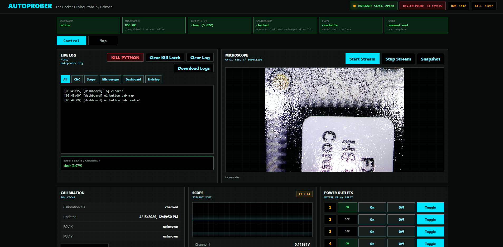
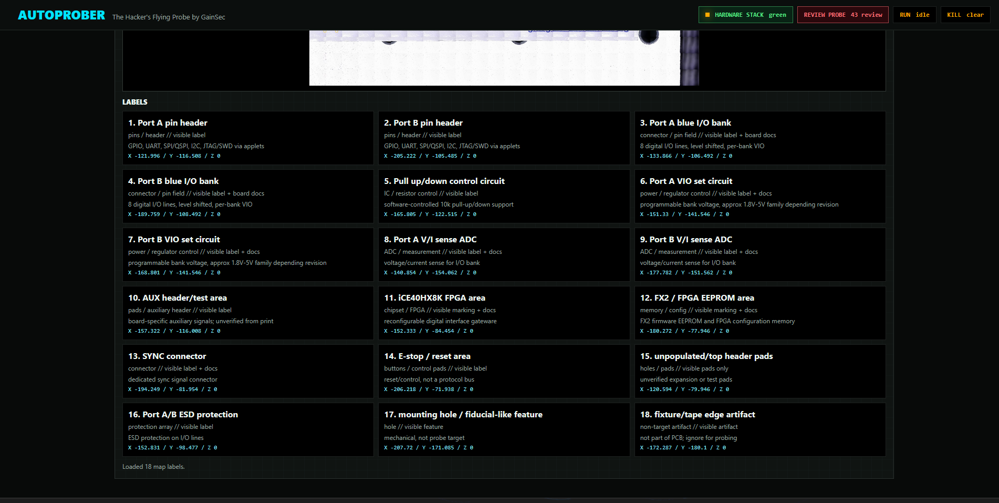
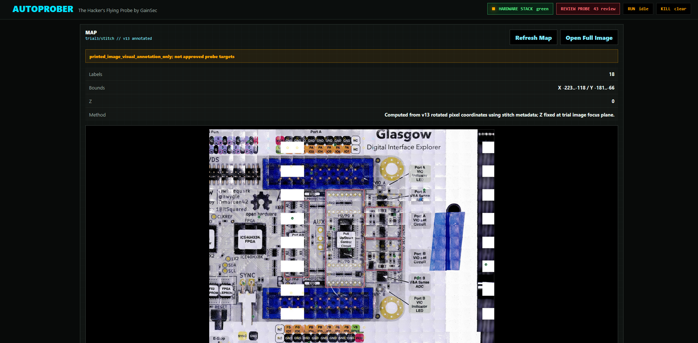
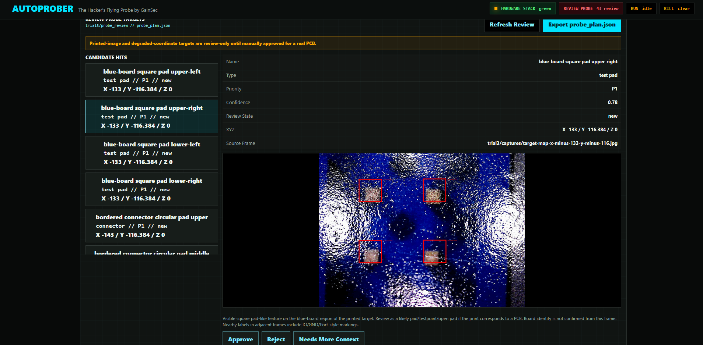
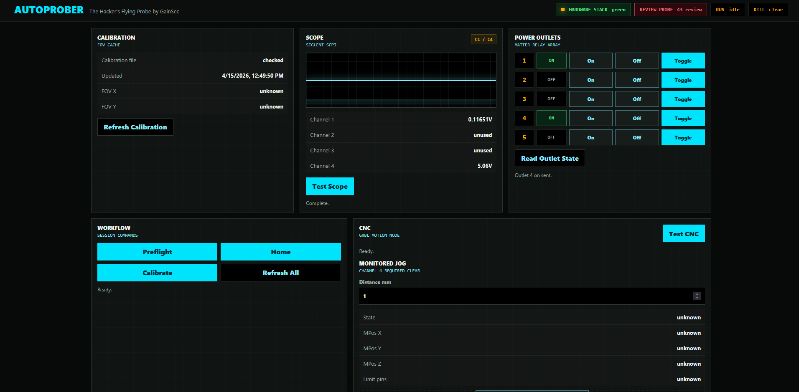
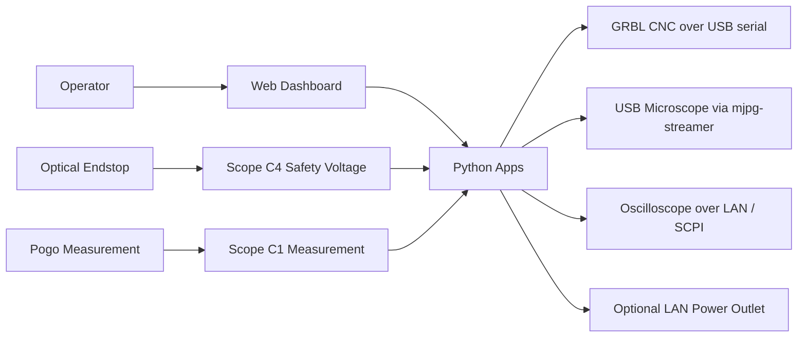
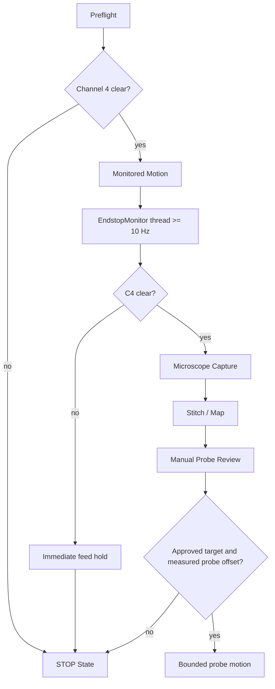
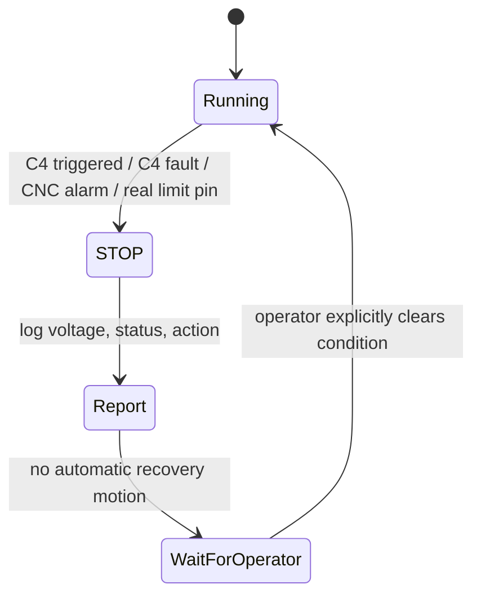

# AutoProber

AutoProber is the hardware hacker's flying probe automation stack for giving
your agent everything it needs to go from "there's a new target on the plate"
to probing individual pins in a safe way.


Demo video: https://gainsec.com/autoprober-demo-mp4/

## Flow

1. Tell the agent to ingest the project.
2. Connect all the hardware.
3. Tell the agent to confirm that all parts are functioning.



4. Have it run homing and then calibration.
5. Attach the custom probe and microscope header.
6. Tell the agent that there is a new target on the plate.
7. It will find where the target is on the plate, then take individual frames,
   keeping a record of the XYZ while noting pads, pins, chips, and other
   interesting features.



8. It will stitch the frames together and annotate the map, including pins and
   interesting components it identified.



9. It will add probe targets to the web dashboard for you to approve or deny.



10. It will probe the approved targets and report back.

All hardware can be controlled through the web dashboard, Python scripts, or by
the agent itself.



This repo is a self-contained source-available release candidate. It contains
the Python control code, dashboard, CAD files, and documentation needed to
create your own AutoProber.

## Safety Model

This project can move physical hardware. Treat it as a machine-control system,
not a normal web app.

The required safety design is:

- GRBL `Pn:P` is ignored. The CNC probe pin is not a trusted endstop.
- The independent safety endstop is read from oscilloscope Channel 4.
- Channel 4 must be continuously monitored during any motion.
- Any Channel 4 trigger, ambiguous voltage, CNC alarm, or real X/Y/Z limit pin
  is a stop condition.
- The agent/operator must stop and report. Recovery motion is not automatic.

Read [docs/safety.md](docs/safety.md) and [docs/operations.md](docs/operations.md)
before running hardware.

## Repository Layout

```text
apps/                 Operator-facing scripts and Flask dashboard entrypoint
autoprober/           Reusable Python package for CNC, scope, microscope, logging, safety
dashboard/            Single-page web dashboard
docs/                 Architecture, device references, operations, and safety guidance
cad/                  Printable STL files for the current custom toolhead
config/               Example environment/configuration files
AGENTS.md             Agent/operator safety rules
LICENSE               PolyForm Noncommercial 1.0.0 license and commercial contact
pyproject.toml        Python project metadata
uv.lock               Locked Python dependency resolution
```

## Hardware Stack

The tested project architecture uses:

- GRBL-compatible 3018-style CNC controller over USB serial
- USB microscope served by `mjpg_streamer`
- Siglent oscilloscope over LAN/SCPI for Channel 4 safety monitoring and
  Channel 1 measurement
- Optical endstop wired to an external 5V supply and oscilloscope Channel 4
- Optional network-controlled outlet for lab power control
- Current printable custom toolhead parts in `cad/`

Default runtime assumptions are documented in the device docs. Replace them
with your own lab settings before use.

For a shopping-oriented hardware list, see [docs/BOM.md](docs/BOM.md).

## Reference Parts

These are the specific parts or part classes used for the prototype release.
Verify current listings, dimensions, voltage, and connector compatibility
before buying.

My build:

- [Optical End Stop](https://www.amazon.com/dp/B08977QFK5)
- [USB Microscope](https://www.amazon.com/dp/B00XNYXQHE)
- [SainSmart Genmitsu 3018-PROVer V2](https://www.amazon.com/dp/B07ZFD6SKP)
- [Matter Smart Power Strip](https://www.amazon.com/dp/B0DYDFKJJJ), individually controlled AC outlets with 2 USB-A and 2 USB-C ports
- [Siglent SDS1104X-E Oscilloscope](https://www.amazon.com/Siglent-SDS1104X-oscilloscope-channels-standard/dp/B0771N1ZF9)
- Dupont wires
- Pen spring or similar light compression spring
- 3D printer for the printable toolhead parts in `cad/`

Optional / interchangeable:

- [Universal Oscilloscope Probes](https://www.amazon.com/dp/B0827JL1T2)
- USB power brick, 5V
- USB 2.0 pigtail cable

## Hardware Architecture



## Runtime Architecture



## STOP State



## Quick Start

Install dependencies:

```bash
uv sync
```

Start the dashboard on a configured hardware host:

```bash
PYTHONPATH=. python3 apps/dashboard.py
```

The dashboard defaults to port `5000`.

## Configuration

Start from [config/autoprober.example.env](config/autoprober.example.env). Do
not publish lab-specific IPs, hostnames, credentials, calibration files, or
captured target images unless you intend to release them.

Important runtime values are configurable:

- `AUTOPROBER_LOG_PATH`: runtime log path
- `AUTOPROBER_RUNTIME_ROOT`: calibration, flat-field, and runtime state directory
- `AUTOPROBER_MICROSCOPE_SNAPSHOT_URL`: microscope snapshot endpoint
- `AUTOPROBER_SCOPE_HOST` / `AUTOPROBER_SCOPE_PORT`: oscilloscope SCPI endpoint
- Dashboard: Flask on port `5000`

Do not commit local environment files that contain lab-specific hosts, paths,
or target data.

## Main Workflows

1. Run preflight checks.
2. Verify Channel 4 is clear.
3. Home and calibrate only when the physical setup is ready.
4. Capture microscope frames with monitored motion.
5. Import or generate target map artifacts for review.
6. Approve probe candidates manually.
7. Execute any probe motion only after microscope-to-probe offset is measured
   and stored.

## What Is Excluded

This release candidate intentionally excludes:

- Trial microscope captures and stitched target images
- Uploaded reference images
- Local backups and archives
- `.venv`, `__pycache__`, Playwright artifacts
- Runtime logs, calibration cache, flat-field images
- Machine-specific SSH/deploy state

See [RELEASE_MANIFEST.md](RELEASE_MANIFEST.md) for details.

## License

This project is source-available under the PolyForm Noncommercial License 1.0.0.

You may use, modify, and share this project for noncommercial purposes.

Commercial use requires a separate paid commercial license.

For commercial licensing, contact: autoprober@gainsecmail.com

## Current Limitations

- The microscope-to-pogo XY offset must be measured before real probing.
- Calibration must not be fabricated; the runtime calibration file should be
  generated on the machine that will move.
- The dashboard is a lab-control tool and should not be exposed to untrusted
  networks.

## Responsible Use

This project is intended for controlled lab work on equipment and targets you
are authorized to test. Do not use it to probe, damage, or analyze systems
without permission.

## Authors

[Jon 'GainSec' Gaines](https://gainsec.com/)
