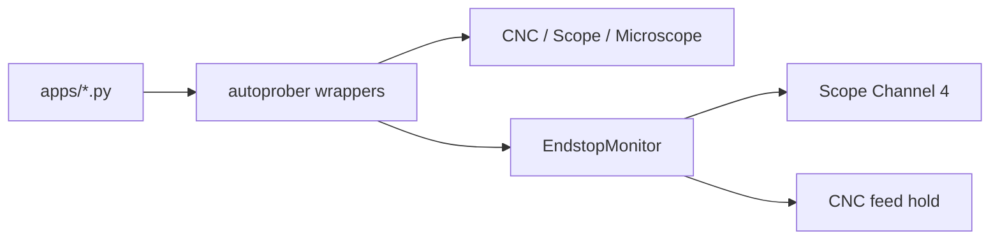

# V2 Architecture

V2 separates application workflows from device transports.

```mermaid
flowchart LR
    Apps[apps/*.py] --> Wrappers[autoprober wrappers]
    Wrappers --> Devices[CNC / Scope / Microscope]
    Wrappers --> Safety[EndstopMonitor]
    Safety --> Scope[Scope Channel 4]
    Safety --> Hold[CNC feed hold]
```

`apps/` coordinates workflows. `autoprober/` owns device access. `EndstopMonitor` owns STOP-state classification.
